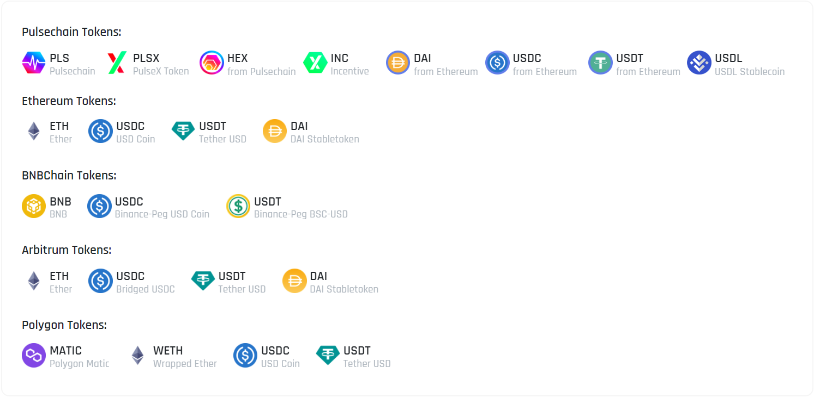

# 🌕 Sacrifice Details


**The sacrifice process has not yet begun!**

Please only follow announcements regarding this matter through official channels/accounts and be cautious of scammers.


#### **IMPORTANT DISCLAIMER**

_Please note that the following information is provided for informational purposes only and should not be considered as professional advice. Consult with legal and financial professionals before making any decisions. If you choose to participate, you must have no expectation of profit derived from the work of others._

***

### **Sacrifice Details ✨**

Pday Sacrifice Round is designed to provide an opportunity for participants to show their support for the Pday protocol. It is important to understand that the sacrifice round is not an investment or a means to earn profits. Participants are contributing tokens to the protocol with no expectation of financial returns. Please carefully read the following information before sacrifice.

Get started on **Pday Sacrifice Portal** now 👇

Sacrifice Portal: [<mark style="color:green;">**sacrifice.pday.ai**</mark>](https://sacrifice.pday.ai) <mark style="color:green;">**✔**</mark>

Sacrifice Wallet: ### NOT LIVE YET! ###

<figure><figcaption></figcaption></figure>

#### Objective:

The Sacrifice Round is designed to demonstrate your commitment to the Pday protocol and its core principles. It is NOT an investment opportunity, and no expectation of profit should be associated with your participation. By making a sacrifice, you are making a **political statement** about the importance of decentralized finance.

#### Duration and Multiplier Rate:

Sacrifice round will last for a total of 31 days, starting from **Mar 01, 15:00 UTC**, until **Apr 01, 15:00 UTC**. Each day, the Multiplier Rate will decrease gradually as follows:

<table data-full-width="false"><thead><tr><th width="162.33333333333331">Period</th><th width="415" align="center">Date</th><th align="center">Multiplier Rate</th></tr></thead><tbody><tr><td>Day 1</td><td align="center">Mar 01, 15:00 UTC - Mar 02, 15:00 UTC</td><td align="center">1,30X</td></tr><tr><td>Day 2</td><td align="center">Mar 02, 15:00 UTC - Mar 03, 15:00 UTC</td><td align="center">1,29X</td></tr><tr><td>Day 3</td><td align="center">Mar 03, 15:00 UTC - Mar 04, 15:00 UTC</td><td align="center">1,28X</td></tr><tr><td>. . . </td><td align="center">. . . </td><td align="center">. . . </td></tr><tr><td>Day 29</td><td align="center">Mar 29, 15:00 UTC - Mar 30, 15:00 UTC</td><td align="center">1,02X</td></tr><tr><td>Day 30</td><td align="center">Mar 30, 15:00 UTC - Mar 31, 15:00 UTC</td><td align="center">1,01X</td></tr><tr><td>Day 31</td><td align="center">Mar 31, 15:00 UTC - Apr 01, 15:00 UTC</td><td align="center">1,00X</td></tr></tbody></table>


Please note that the Pday Sacrifice Round will be active during this period, and once it is completed, no further sacrifices will be accepted.


#### Eligible Tokens

Only specific tokens listed in the "Accepted Assets" section will be accepted for sacrifice. Any other contributions made with unsupported tokens will not be considered for the calculation of Sacrifice Points.

<figure><figcaption>
<strong>Accepted Assets</strong>
</figcaption></figure>

#### **Leaderboard Bonus Program 🎁**

After the completion of the Sacrifice phase, a bonus reward will be provided to the top 10 wallets listed on the leaderboard, in addition to their multiplier rate. The bonus percentages for the top-ranked wallets are as follows:

* The 1st ranked wallet will receive an additional 10% bonus.
* Wallets ranked 2nd to 5th will receive an additional 8% bonus.
* Wallets ranked 5th to 10th will receive an additional 5% bonus.\

#### Wallet Restrictions

It is important to make the sacrifice from a wallet where you have complete control of your private keys. Contributions made from centralized exchanges or wallets where you do not have direct access to your private keys will not be accepted.

#### Points Calculation

Sacrifice Points will be calculated based on the USD value at the time of the transaction. The points table will be updated frequently on Sacrifice Portal, reflecting the current status of each participant.

#### Final Stage

After the completion of the Pday Sacrifice Round, there will be a one-week break to consolidate the contributions. A portion of the assets will be allocated to provide liquidity for the token's swap operations across multiple decentralized exchanges (DEX) protocols. Additionally, a portion of the assets will be held in the treasury for potential future listings on both centralized and decentralized exchanges.

***

_Please be aware that the Pday Sacrifice Round is not intended as a profit-making endeavor, but rather a voluntary act of support for the protocol's principles. Sacrificers are voluntarily contributing without any expectations of financial gains or protocol revenue sharing. The primary goal is to support the Pday ecosystem and demonstrate a commitment to its principles and values._

_Please be aware that participating in the sacrifice round carries its own risks and implications. Ensure you fully understand the terms and conditions outlined by the Pday team and seek professional advice if needed._
