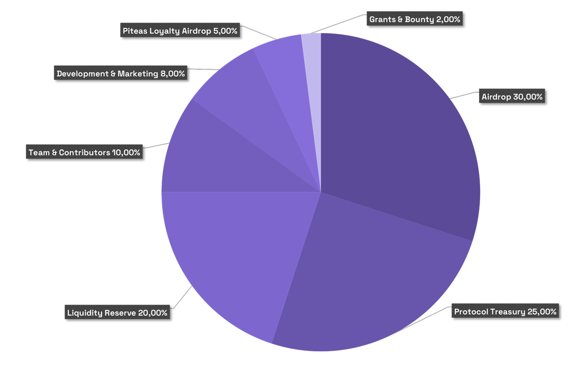

# 🪙 Tokenomics


**Not deployed yet!** Please be cautious of fake token addresses and contracts. We strongly recommend ensuring you are using the official token contract only!


### **PDAY Token**

PDAY Token is the utility token of Pday and represents voting rights in the upcoming governance model. It has an organic connection with the Pday protocol and its revenue model, making it essential for the protocol's sustainable economy.

#### Token Contract and Details 👇


[overview.md](overview.md)


### **Tokenomics Detail:**

<table data-header-hidden data-full-width="true"><thead><tr><th width="259"></th><th width="151" align="center"></th><th width="162" align="center"></th><th width="435"></th></tr></thead><tbody><tr><td>Protocol Treasury</td><td align="center">25%</td><td align="center">25,000,000</td><td>Team/DAO Management - Locked</td></tr><tr><td>Airdrop</td><td align="center">25%</td><td align="center">25,000,000</td><td>100% unlock at TGE</td></tr><tr><td>Liquidity Reserve</td><td align="center">15%</td><td align="center">15,000,000</td><td>100% unlock at TGE</td></tr><tr><td>Incentives and Rewards</td><td align="center">10%</td><td align="center">10,000,000</td><td>10% at TGE, then linear vesting for 10 months</td></tr><tr><td>Team &#x26; Contributors</td><td align="center">10%</td><td align="center">10,000,000</td><td>10% at TGE, then linear vesting for 10 months</td></tr><tr><td>Development &#x26; Marketing</td><td align="center">8%</td><td align="center">8,000,000</td><td>10% at TGE, then linear vesting for 10 months</td></tr><tr><td>Piteas Loyalty Airdrop</td><td align="center">5%</td><td align="center">5,000,000</td><td>100% unlock at TGE</td></tr><tr><td>Grants &#x26; Bounty</td><td align="center">2%</td><td align="center">2,000,000</td><td>10% at TGE, then linear vesting for 10 months</td></tr><tr><td><strong>Total</strong></td><td align="center"><strong>100%</strong></td><td align="center"><strong>100,000,000</strong></td><td><em>Initial suppy: 48,000,000 PDAY</em></td></tr></tbody></table>

Here are some details about token allocations 👇

* **Protocol Treasury**: Allocated for Pday' future plans and is decided not to be used without community approval. It can be used in later stages with community approval for purposes like expanding to different networks, sourcing liquidity, or similar processes.
* **Airdrop**: Allocated for individuals who contributed during the sacrifice process and distributed fairly. A small portion is reserved for potential airdrops to incentivize protocol usage in the future.
* **Liquidity Reserve**: Approximately 50-75% provided as liquidity during the token launch phase. The remaining assets are held in reserve for future liquidity provision stages.
* **Incentives and Rewards**: Used for rewarding liquidity providers and stakers, supporting protocol partnerships, funding developments that help grow the ecosystem, grants, and other related purposes.
* **Team & Contributors**: Allocated for developers and salaried individuals who support the protocol's development.
* **Development & Marketing**: Allocated to cover expenses related to marketing Pday and to support the majority of technological developments and expenses of the protocol.
* **Piteas Loyalty Airdrop:** These tokens will be used for a customized reward system for participants of Piteas's sacrifice and PTS holders.
* **Grants & Bounty**: Allocated for third-party applications and personal initiatives related to protocol security, development, and marketing.

_It is essential to transfer unused, idle, or tokens that have been deemed unnecessary for planning changes to the treasury._

**Token Distribution**

<figure><figcaption>
Tokenomics - Share
</figcaption></figure>
